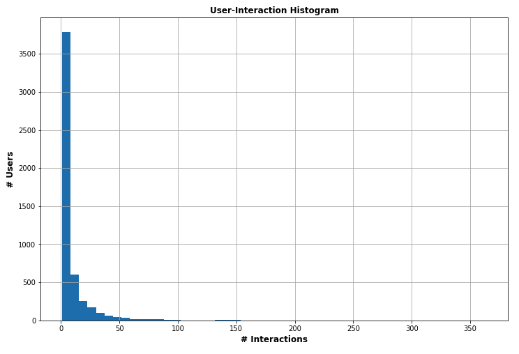

# Recommendation Engine Project
The goal of this project is to analyze the interactions that users have with articles on the IBM Watson Studio platform, and then create a recommendation engine to make suggestion to users about new articles they might like.  

The projecte is completed as a Jupyter notebook available [here](./Recommendations_with_IBM.ipynb): in it we can distinguish V different sections, that will be described in more detail here in the following.  
The notebook was originally provided by Udacity, and each section included a list of questions and tasks that have been now completed. The original template also 
included some test functions to be called while progressing, to check on the results.

## Sect. I - Exploratory Data Analysis
The data to work with consist of two different dataframes:

* One called simply `df`, including information about the usage of each article available in the platform, with their title and an id of a user that has interacted with it. Users were initially identified through their email, but this gets later changed in a more practical and simpler `user_id`.
* Another one called `df_content`, that lists all the articles, with more detailed information like a description and the body content, but without data on their actual usage.

In this section a few questions are asked in terms of data analysis: number of unique articles, unique users etc. As a quick summary:

 _Questions_    | _Answers_     |
| ------------- |:-------------:| 
| # of unique articles that have an interaction with a user | 714 | 
| # of unique articles in the dataset | 1051 |
| # of unique users in the dataset | 5148 |
| Total # of user-article interaction | 45993 |
| `id` of the most viewed article | `1429.0` |
| # of views for the most viewed article | 937 |

To get some more insight on the distribution of user-article interactions we can take a look at the histogram:

  

More quantitatively, the analysis showed that:

* 75% of the users interacted with less than 10 articles;
* Isolated peaks are possible, with a max of 364 interactions counted from a single user.

## Sect. II - Rank-Based Recommendations
The first kind of recommendations that we try to provide are based on _rank_: given any user, we can provide them a list of the highest ranked items in our dataset.  
In this case, rank is measured through user-article interactions: the higher the number of interactions is, the higher the rank of the article will be considered to be.  

As an example of the outcome of this section we can see:

## Sect. III - User-User Based Collaborative Filtering

## Sect. IV - Content-Based Recommendations (OPTIONAL)

## Sect. V - Matrix Factorization

