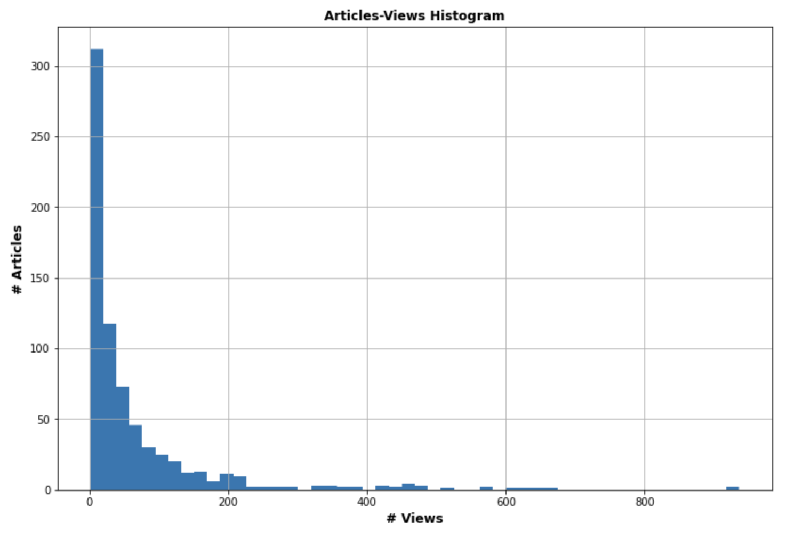
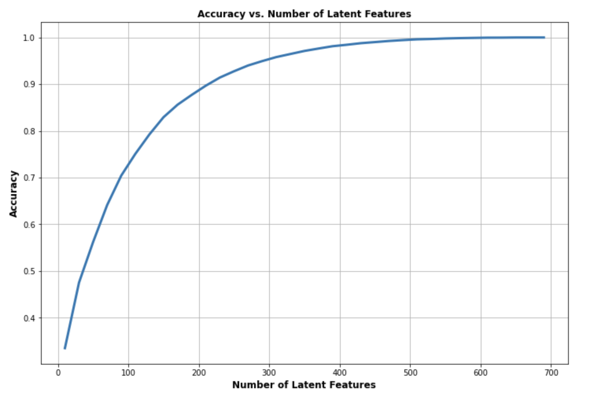
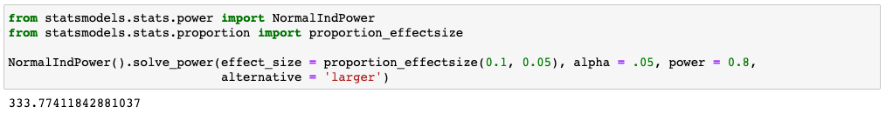

# Recommendation Engine Project
The goal of this project is to analyze the interactions that users have with articles on the IBM Watson Studio platform, and then explore several recommendation strategies to make suggestion to users about new articles they might like.  

The projecte is completed as a Jupyter notebook available [here](./Recommendations_with_IBM.ipynb): in it we can distinguish V different sections, that will be described in more detail here in the following:  

* [Section I](#sect-i---exploratory-data-analysis)
* [Section II](#sect-ii---rank-based-recommendations)
* [Section III](#sect-iii---user-user-based-collaborative-filtering)
* [Section IV](#sect-iv---content-based-recommendations)
* [Section V](#sect-v---matrix-factorization)

Finally, a [Conclusions](#conclusions) section will summarize overall findings and describe possible next steps. 

## Sect. I - Exploratory Data Analysis
The data to work with consist of two different dataframes:

* One called simply `df`, including information about the usage of each article available in the platform, with their title and an id of a user that has interacted with it. Users were initially identified through their email, but this gets later changed in a more practical and simpler `user_id`.
* Another one called `df_content`, that lists all the articles, with more detailed information like a description and the body content, but without data on their actual usage.

In this section a few questions are asked in terms of data analysis: number of unique articles, unique users etc. As a quick summary:

 _Questions_    | _Answers_     |
| ------------- |:-------------:| 
| # of unique articles that have an interaction with a user | 714 | 
| # of unique articles in the dataset | 1051 |
| # of unique users in the dataset | 5148 |
| Total # of user-article interaction | 45993 |
| `id` of the most viewed article | `1429.0` |
| # of views for the most viewed article | 937 |

To get some more insight on the distribution of user-article interactions we can take a look at the histogram:

  

More quantitatively, the analysis showed that:

* 75% of the users interacted with less than 10 articles;
* Isolated peaks are possible, with a max of 364 interactions counted from a single user.

Another area where some graphical insight can be provided is around the absolute number of views per article:

  

It can be seen how the majority of articles sits below 100 views, with some articles that are more popular.

## Sect. II - Rank-Based Recommendations
The first kind of recommendations that we try to provide are based on _rank_: given any user, we can provide them a list of the highest ranked items in our dataset.  
In this case, rank is measured through user-article interactions: the higher the number of interactions is, the higher the rank of the article will be considered.  

As an example of the outcome of this section we can see the **top 7** ranked articles:

  

## Sect. III - User-User Based Collaborative Filtering
The second family of recommendations is based on a _collaborative_ approach, in which we investigate the dataset to identify _similarities_ between users.

* First of all, starting from the `df` dataframe we obtain a user-item matrix in which, for each unique user, we identify the article that they interacted with:

  

* Then we implement a similarity metric based on the number of seen articles that two users have in common:  the higher that number, the more similar the users are considered to be.   
In the notebook there are actually two differnt proposals to measure this kind of similarity: one makes use of the dot product and another of the [cosine similarity](https://en.wikipedia.org/wiki/Cosine_similarity).

* Based on the information above it is possible to implement a function that, given in input a `user_id` and an integer `m`, is capable of returning the first `m` articles read by the users that are the most similar to `user_id`, and that `user_id` has not yet interacted with.
* This function is than further refined to take into account also the absolute number of interactions that characterizes an article.

As an example of the outcome of this section we can see the **top 10** recommendations for **user 20**:

  

It is worth noting here that this method of generating recommendations cannot be used for brand new users, givrn that in that case there would not be enough information to assess similarity with existing ones.  
This is not true for the rank-based approach, than doesn't need any prior information.
 

## Sect. IV - Content-Based Recommendations
**Note**: This section was marked as "Optional" in the original notebook.  

The strategy of recommendation implemented here will be based on _content_: a relationship between articles will be found based on some content charactrizing them, like title or description. 

More specifically: 

* The implemented solution looks for similar **titles** between the totality of the articles and an `article_id` provided as input. 
* This is powered by an NLT pipeline that includes a tokenizer, a lemmatizer and a [TfIdf vecorizer](https://scikit-learn.org/stable/modules/generated/sklearn.feature_extraction.text.TfidfVectorizer.html). 
* The similarity between TfIdf vectors (corrensponding to titles) is measured through cosine similarity.  
* All of the above is wrapped in a function that takes in input the `article_id` and an integer `m` and returns the lists of the `m` most similar article ids and titles.

As an example of the outcomes in this case we can see the **top 5** recommendations that are similar to **article 235**:

  

As a final note, the current implementation of this recommendation strategy would not work for new users: however, a slightly modified approach is thinkable in which users are asked to provide a list of keywords and the NLP pipeline would then look for similarities in the titles. This would work even with no prior interaction known.

## Sect. V - Matrix Factorization
As a final example of recommendation strategies, we can apply decomposition technicques on the `user_item` matrix defined in [Part III]((#sect-iii---user-user-based-collaborative-filtering)), and then leverage ML technicques to evaulate the quality of the suggestion we make.

### Matrix Decomposition
* For what concerns the SVD decomposition, in our case we can actually implement the exact closed form as provided by the [`numpy`](https://numpy.org/doc/stable/reference/generated/numpy.linalg.svd.html) library. This is possible because, in our case, the matrix is actually _full_: although sparse, with a prevalence of 0's vs. 1's, we have no `null`, hence there is no need to leverage iterative algorythms like [FunkSVD](https://en.wikipedia.org/wiki/Matrix_factorization_(recommender_systems)#Funk_MF).  
The outcome of the decomposition leads to a vector of **714 latent features**:

  

* In order to verify how many of those features are actually necessary, we can perform an evaluation of the accuracy of the results comparing, for different numbers of latent features, the reconstructed matrix with the actual one, and measuring the difference.  
We end up with something like this:

  

* We can see how, already at ~250 features we have an accuracy > 90%. However, this analysis doesn't give insights on how good this decomposition would be in providing _predictions_: for this we'll need next section.

### ML Approach
To apply an ML-inspired approach we can:

* Split the `df` dataframe in `train`/`test` portions;
* Decompose the `train` part according to SVD, and use it to reconstruct example of user/item interactions that will be evaluated against the `test` matrix.

If we go ahead in doing so, as documented in the notebook, we find quickly that there are **only 20 users** that would be present in both the `train` and `test` datasets.  
Such a low number has an immediate affect on the quality of the predictions we can make. Indeed, if we attempt at measuring the accuracy for different numbers of latent features (as done previously), we obtain something like this:

  

The same behaviour is visible also in terms of MSE:

  

We can see how:

* Considering the training data (i.e. the capability to reconstruct the train data starting from the factorization matrices) we reach a very high accuracy even with just 10 features;
* Considering the test data (i.e. the capability to actually _predict_ behaviours) we see that the performances actually _worsen_ witht the number of features considered 
 
All of that confirms that the unbalanced data is leading to a form of "overfitting", where we create a model that is extremely close to the train data, but not flexible enough to handle different configurations. 

## Conclusions
In going through this project we could see a few examples of recommendations engines applied to the data coming from the Watson IBM platform.  

Each strategy has pros and cons, and works better in some circumstances; in general, I think that the most relevant takeaways could be:
 
* Only some of the methods can be applied in the case of brand new users, with no existing records of interactions. As a matter of a fact, the only implemented solution that would work in that case is the _rank_-based;
  * However, as I mention in [Section IV](#sect-iv---content-based-recommendations), the _content_-based approach could be adapted to work in that case too, leveraging, for example, keywords or example statements provided by the users.
* The usage of ML strategies to evaluate the quality of the suggestions provided turned out to be quite challenging, given the available data;
  * There is a (very) limited number of users that can be referenced to test recommendations: this, together with the very sparse nature of the matrices describing the datasets, leads to a very unbalanced prediction model, prone to overfitting.

As a way to move forward, for sure the various strategies could become different methods implemented within a common engine, to be used depending on the various situations: however, for an appropriate evaluation of any kind of solution, an extension or improvement of the dataset seems necessary. 

Another possible approach could be to implement some form of online evaluation of the recommendation engine, using, for example **A/B testing**.  
Users could be randomly assigned to a web page making use of a specific implementation of a recommendation engine, and their behaviour would be compared with that of a control group running a default page. The groups could be separated based on cookies (to keep track of the session) and some tracking could be done to check whether or not a user would actually interact with one of the suggested articles, i.e. actually follows the suggestions.

The sizing of such a kind of experiment (i.e. deciding how many samples we would need and, consequently, for how long to run it) would depend on the level of practical significance needed and the value of Type I/Type II error rate (alpha/beta) accepted. To support in that assessment one could use, for example, Python libraries like the [`power`](https://www.statsmodels.org/stable/stats.html#power-and-sample-size-calculations) module available as part of the [`statsmodels`](https://www.statsmodels.org/stable/index.html) package.

An example of the output that such libraries would provide can be seen with the last cell of the notebook:

  

Wher we can see that, in order to evaluate a change in the average number of users following the suggestions of the recommendation engine from 5% to 10%, with alpha = 5% and beta = 20% (hence test power of 80%) we would need more than **330** users in both the control and experimental group.

